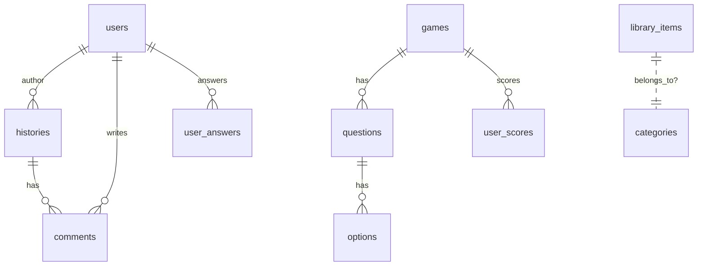

# Diagramación de la Base de Datos

A continuación se describe el modelo de datos a alto nivel. Puedes generar una imagen a partir de esta descripción usando una herramienta de tu preferencia (Draw.io, Mermaid, dbdiagram.io).

## Entidades y relaciones (texto)
- users (id, name, email, password, ...)
- histories (id, title, body, cover_path, video_url, video_path, metadata, ...)
- categories (id, name, ...)
- library_items (id, title, type[file|link|video], file_path, external_url, cover_path, provider[youtube|vimeo|null], ...)
- events (id, title, date, location, ...)
- games (id, title, type, ...)
- questions (id, game_id, text, ...)
- options (id, question_id, text, is_correct)
- user_answers (id, user_id, question_id, selected_option_id, is_correct)
- user_scores (id, user_id, game_id, score)
- comments (id, user_id, history_id|null, body)
- news (id, title, body, published_at)

Relaciones:
- history belongsToMany categories (si se usa categorización múltiple).
- library_item puede pertenecer a una categoría (opcional) y aceptar media.
- game hasMany questions; question hasMany options; user_answer belongsTo user & question.
- user_score belongsTo user & game.
- comments belongsTo users y polymorphic a histories/news (según implementación actual).

## Mermaid (opcional)
Si tu README lo soporta, incluye un diagrama Mermaid en otra sección:

> Nota: Ajusta las relaciones exactamente a tu esquema si difiere.
