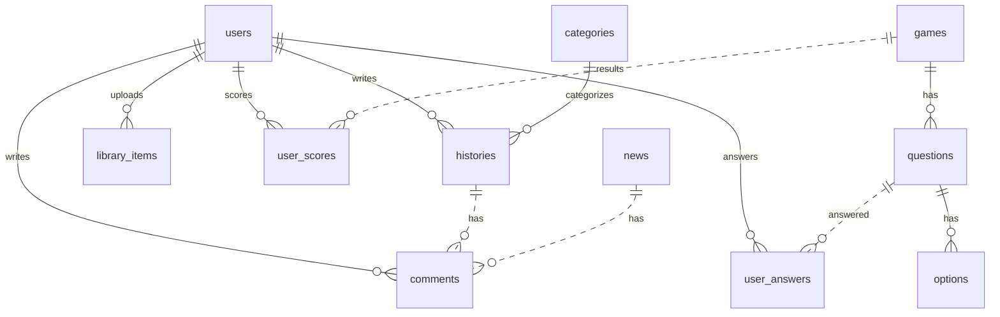

# Diagramación de la Base de Datos

Modelo acorde a las migraciones actuales.

## Tablas principales (campos clave)
- users (id, name, email, password, ...)
- categories (id, name, slug)
- histories (id, user_id, category_id?, title, slug, excerpt?, content, cover_path?, era?, leading_figure?, video_url?, video_path?)
- library_items (id, user_id, title, type, description?, cover_path?, file_path?, external_url?, video_url?, video_caption?)
- comments (id, commentable_id, commentable_type, user_id, body, vote)
- games (id, user_id, title, description?, points_per_question)
- questions (id, game_id, statement)
- options (id, question_id, text, is_correct)
- user_answers (id, user_id, question_id, selected_answer, is_correct)
- user_scores (id, user_id, game_id?, points, score, quizzes_taken, games_played, source?)
- news (id, title, body, published_at)
- events (id, title, date, location, ...)

## Relaciones
- histories: belongsTo users; belongsTo categories (nullable)
- library_items: belongsTo users
- comments: morphs a (histories | news | otros), belongsTo users
- games: belongsTo users; hasMany questions
- questions: belongsTo games; hasMany options
- options: belongsTo questions
- user_answers: belongsTo users; belongsTo questions
- user_scores: belongsTo users; belongsTo games (nullable)

## Mermaid

